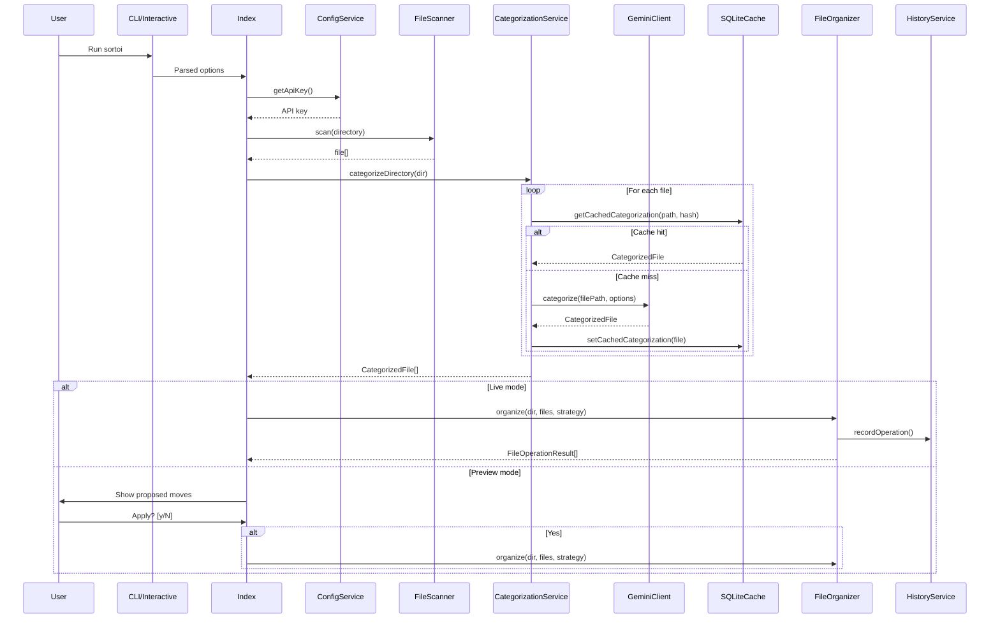

# Sortoi — Architecture Documentation

## Overview

Sortoi follows a **Clean Architecture** pattern with clear separation between application, core domain, infrastructure, and common utilities. Dependencies flow inward: infrastructure depends on core interfaces, never the reverse.

---

## Layer Diagram

```mermaid
graph TB
    subgraph "Application Layer"
        CLI["cli.ts<br/>(Commander.js)"]
        Interactive["interactive.ts<br/>(Guided prompts)"]
        History["history.ts<br/>(Session management)"]
        Index["index.ts<br/>(Entry point)"]
    end

    subgraph "Core Domain"
        Types["types.ts<br/>(Interfaces)"]
        CatService["CategorizationService<br/>(Orchestrator)"]
        Config["ConfigurationService<br/>(API key mgmt)"]
        Errors["errors.ts<br/>(Error classes)"]
    end

    subgraph "Infrastructure"
        Gemini["GeminiClient<br/>(AI SDK)"]
        Scanner["FileScanner<br/>(Directory scan)"]
        Organizer["FileOrganizer<br/>(Move files)"]
        Conflict["ConflictResolver<br/>(Name conflicts)"]
        SQLite["SQLiteDatabaseService<br/>(Cache)"]
        HistSvc["HistoryService<br/>(Rollback)"]
        Metrics["MetricsCollector<br/>(Stats)"]
        Telemetry["TelemetryService<br/>(Error reports)"]
        Logger["Logger<br/>(Winston)"]
        Output["ConsoleOutput<br/>(Chalk)"]
        Progress["ProgressBar<br/>(cli-progress)"]
        PathVal["PathValidator<br/>(Security)"]
    end

    subgraph "Common"
        Constants["constants.ts<br/>(Limits, regex)"]
        FileUtils["fileUtils.ts<br/>(SHA-256 hashing)"]
        PathUtils["pathUtils.ts<br/>(Path helpers)"]
    end

    Index --> CLI
    Index --> Interactive
    Index --> CatService
    Index --> Config
    CatService --> Types
    CatService --> Gemini
    CatService --> Scanner
    CatService --> SQLite
    CatService --> Metrics
    CatService --> Telemetry
    Gemini --> Types
    Scanner --> Constants
    Organizer --> Conflict
    Organizer --> HistSvc
    CatService --> FileUtils
```

---

## Data Flow

---

## Layers in Detail

### 1. Application Layer (`src/app/`)

| File | Purpose |
|------|---------|
| `cli.ts` | Defines CLI flags with Commander.js (`--dry-run`, `-l`, `-m`, `-c`, `-p`, etc.) |
| `interactive.ts` | Guided step-by-step prompts for directory, mode, language, model, context, folder structure |
| `history.ts` | Sub-commands: `list`, `show <id>`, `rollback <id>`, `clear` |

### 2. Core Domain (`src/core/`)

| File | Purpose |
|------|---------|
| `types.ts` | All interfaces: `ILLMClient`, `IFileScanner`, `IDatabaseService`, `IOutputPort`, `IProgressReporter`, `IFileOrganizer`, and data types (`CategorizedFile`, `CategorizationOptions`) |
| `CategorizationService.ts` | Orchestrates scanning → hashing → AI categorization → caching. Handles retries, concurrency (via `p-limit`), and error classification |
| `ConfigurationService.ts` | Manages the `GOOGLE_GENERATIVE_AI_API_KEY` — loads from `.env` (dev), `~/.sortoi/.env` (global), or interactive prompt |
| `errors.ts` | `SortoiError` (with error codes E001–E999) and `CategorizationError` (with typed reasons) |

### 3. Infrastructure Layer (`src/infrastructure/`)

| File | Purpose |
|------|---------|
| `GeminiClient.ts` | Implements `ILLMClient`. Uses `@ai-sdk/google` + Vercel AI SDK `generateObject()` with Zod schema validation |
| `FileScanner.ts` | Implements `IFileScanner`. Reads directory entries, skips hidden/unsafe files, enforces `MAX_FILES` limit |
| `FileOrganizer.ts` | Implements `IFileOrganizer`. Creates category directories, moves files, records history |
| `ConflictResolver.ts` | Handles filename collisions: SKIP, OVERWRITE, RENAME (appends `(1)`, `(2)`, etc.) |
| `SQLiteDatabaseService.ts` | Implements `IDatabaseService`. SQLite cache keyed by `(file_path, file_hash)` |
| `HistoryService.ts` | Session-based operation tracking. Saves/loads JSON. Supports full rollback |
| `MetricsCollector.ts` | Tracks success/failure/cache stats. Prints ASCII summary table |
| `TelemetryService.ts` | Captures unknown errors with full system metadata to `.ai-file-sorter/telemetry/` |
| `PathValidator.ts` | OS-aware path sanitization. Blocks traversal, shell metacharacters, Windows reserved names |
| `Logger.ts` | Winston logger with file + console transports |
| `ConsoleOutput.ts` | Chalk-based colored console output implementing `IOutputPort` |
| `ProgressBar.ts` | `cli-progress` wrapper implementing `IProgressReporter` |

### 4. Common (`src/common/`)

| File | Purpose |
|------|---------|
| `constants.ts` | `LIMITS` (max files, concurrency, retries), `REGEX` (safe filename), `RETRY` (backoff), `ConflictStrategy` enum |
| `utils/fileUtils.ts` | Smart file hashing: full SHA-256 for ≤100MB, partial hash + metadata for >100MB |
| `utils/pathUtils.ts` | `getFileName()` — cross-platform filename extraction |

---

## Key Design Decisions

1. **Interface-driven**: All infrastructure is behind interfaces (`ILLMClient`, `IFileScanner`, etc.) enabling testability and swappability.
2. **Structured AI output**: Uses Zod schema + `generateObject()` instead of free-text parsing for reliable category extraction.
3. **Smart caching**: SHA-256 file hashes ensure only modified files are re-analyzed. Large files (>100MB) use partial hashing for performance.
4. **Full rollback**: Every file move and directory creation is recorded in a session, enabling one-command undo.
5. **Security-first**: Path validation, filename sanitization, API key encryption, and DoS protection (file count limits).
